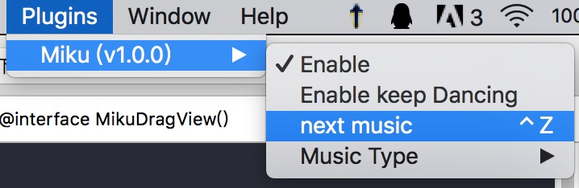

# Miku

Miku is a plugin for Xcode. A copy of atom-miku.

I forked this project from [here](https://github.com/poboke/Miku).

Miku是一个在Xcode里召唤**程序员鼓励师**的插件，在敲击代码时Miku会唱歌和跳舞，歌曲来自于你的~/Music下的所有.mp3文件。是原作者仿照[atom-miku](https://github.com/sunqibuhuake/atom-miku)移植到Xcode下的。原项目[在此](https://github.com/poboke/Miku)。

这里，我添加了一个切换下一首的菜单项，也可以使用快捷键(control+z)。

